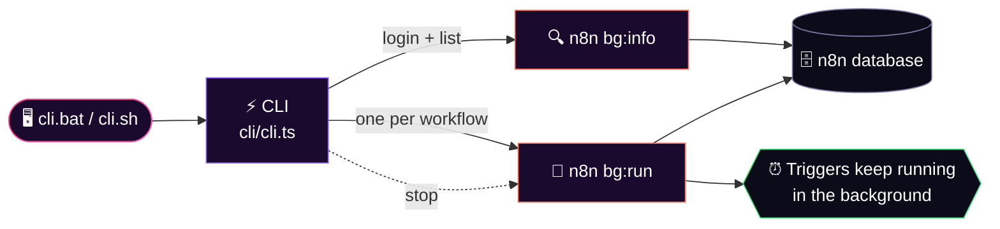

<div align="center">


<br/>


### ⚡ Log in. Pick your workflows. Walk away. ⚡

**Run n8n workflows in the background, no server and no localhost needed.**

[🚀 Quick Start](#-quick-start) · [🧠 How It Works](#-how-it-works) · [🎮 Using The CLI](#-using-the-cli) · [🛠️ Troubleshooting](#%EF%B8%8F-troubleshooting)

</div>

---

## ✨ Features

| | |
|---|---|
| 🎨 **Gorgeous terminal UI** | Colored ASCII banner, arrow-key menus, spinners, zero extra dependencies |
| 🔐 **Real login** | Uses your normal n8n account, checked against the n8n database |
| 🧵 **True background workflows** | One detached process per workflow, they keep running after the CLI closes |
| 🛑 **Stop anything, anytime** | Run the CLI again: stop **all**, or pick **one** |
| 🪄 **No publishing needed** | Run any workflow with a trigger, stopping it fully stops it |
| 📜 **Per-workflow logs** | Saved to `~/.n8n-cli/logs/<workflow-id>.log` |

---

## 📋 Requirements

> [!IMPORTANT]
> You need the **latest Node.js** version installed. Get it at [nodejs.org](https://nodejs.org).

---

## 🚀 Quick Start

### ① Enable Corepack

```bash
corepack enable
```

### ② Install dependencies

```bash
pnpm install
```

### ③ Build n8n

```bash
pnpm build
```

### ④ Start n8n *(one time only, to create your account)*

```bash
pnpm start
```

Then:

1. 🌐 Open **http://localhost:5678**
2. 👤 Create an account
3. 📝 **Remember the email and password** (the CLI asks for them)
4. 📥 Import or create a workflow, then give it a **name**
5. ⏹️ Stop n8n with `Ctrl + C`, you won't need it running again

> [!TIP]
> After this one-time setup you **never** have to start n8n on localhost again. The CLI does everything.

### ⑤ Launch the CLI

<table>
<tr>
<td width="50%" align="center">

### 🪟 Windows

```bash
cli.bat
```

</td>
<td width="50%" align="center">

### 🐧 Linux / 🍎 Mac

```bash
cli.sh
```

</td>
</tr>
</table>

### ⑥ Follow the steps, and you're done 🎉

---

## 🎮 Using The CLI

```text
 ________   ________  ________           ________  ___       ___
|\   ___  \|\   __  \|\   ___  \        |\   ____\|\  \     |\  \
\ \  \\ \  \ \  \|\  \ \  \\ \  \       \ \  \___|\ \  \    \ \  \
 \ \  \\ \  \ \   __  \ \  \\ \  \       \ \  \    \ \  \    \ \  \
  \ \  \\ \  \ \  \|\  \ \  \\ \  \       \ \  \____\ \  \____\ \  \
   \ \__\\ \__\ \_______\ \__\\ \__\       \ \_______\ \_______\ \__\
    \|__| \|__|\|_______|\|__| \|__|        \|_______|\|_______|\|__|

✔ Email: you@example.com
✔ Password: ••••••

? Select workflows to run in the background
❯ ◉ Daily report
  ◉ Sync CRM
  ◯ Backup

✔ Started Daily report
✔ Started Sync CRM

2 workflow(s) running in the background.
```

**Run the CLI again while workflows are running:**

```text
Running workflows (2):
  ● Daily report (pid 4242)
  ● Sync CRM (pid 4243)

? What do you want to do?
❯ Stop all running workflows
  Stop a specific workflow
  Start more workflows
  Log out
  Exit
```

| Key | Action |
|:---:|:---|
| `↑` `↓` | Move |
| `Space` | Select / unselect a workflow |
| `A` | Select all |
| `Enter` | Confirm |
| `Ctrl + C` | Quit |

---

## 🧠 How It Works



<details>
<summary><b>📂 Project files (click to expand)</b></summary>

<br/>

| File | What it does |
|:---|:---|
| `cli/cli.ts` | The CLI: banner, login, menus, starting and stopping processes |
| `cli/ui.ts` | Built-in prompts: select, checkbox, input, password, spinner |
| `packages/cli/src/commands/bg/info.ts` | `n8n bg:info`, verifies login and lists workflows |
| `packages/cli/src/commands/bg/run.ts` | `n8n bg:run --id=<id>`, runs one workflow's triggers without a server |

</details>

---

## ⚠️ Good To Know

> [!NOTE]
> - ⏰ **Schedule, polling and app triggers** work great in the background.
> - 🌐 **Webhook triggers** can't receive requests, because there is no HTTP server.
> - 🗄️ With **SQLite**, lots of workflows at once can sometimes cause a "database is locked" error.
> - 🚫 Don't run a normal `pnpm start` at the same time, or workflows can fire twice.

---

## 🛠️ Troubleshooting

<details>
<summary><b>❌ "n8n did not answer"</b></summary>

<br/>

The build is missing or out of date. Run `pnpm build` again, then test with:

```bash
node packages/cli/bin/n8n bg:info
```

You should see a line starting with `@@N8NCLI@@`.

</details>

<details>
<summary><b>🔑 "Invalid email or password"</b></summary>

<br/>

Use the same email and password you created in the editor at `localhost:5678`.

</details>

<details>
<summary><b>💥 A workflow won't start</b></summary>

<br/>

Open its log file: `~/.n8n-cli/logs/<workflow-id>.log`

</details>

<details>
<summary><b>🧹 Reset the CLI</b></summary>

<br/>

Delete `~/.n8n-cli/state.json`. This only clears the CLI's login and running list. n8n itself isn't touched.

</details>

---

<div align="center">

### 💜 Built on top of [n8n](https://n8n.io)

⭐ **Star the repo if this saved you time!** ⭐

</div>